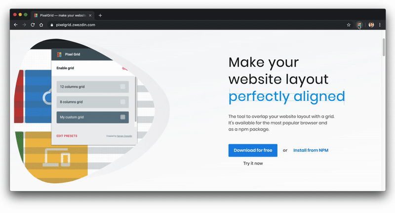

<a href="https://pixelgrid.zwezdin.com"></a>


[](https://travis-ci.org/pixel-grid/pixelgrid)
[](https://www.npmjs.com/package/@sergeyzwezdin/pixelgrid)

The tool to overlap your website layout with a grid. It’s available for the most popular browser and as an npm package.



## Usage

There are two options on how to use PixelGrid — install the package via NPM or use a browser extension.

### NPM

Use NPM when you want to integrate PixelGrid into your website and control the moment when you want to display the grid on your own.

It could be useful for cases when you don't want to install the browser extension, or there is no extension for your particular browser.

1. Install the package:

```bash
> npm install @sergeyzwezdin/pixelgrid
```

2. Add layout grid to your website

```javascript
import { initializeGrid } from ‘@sergeyzwezdin/pixelgrid’;

const presets = [{
        grids: [
        {
            type: 'grid',
            color: '#000000',
            opacity: 0.2,
            size: 8
        }
    }];

initializeGrid(presets);
```

### Browser extensions

If you don't want to mess up your website with additional packages, it could be a good option to use browser extension instead. In this case, you don't need to integrate anything into your website sources. You have to install a browser extension instead.

For the moment following browser extensions are supported:
1. [Google Chrome](https://chrome.google.com/webstore/detail/pixelgrid/chfoojhjeehllcanheedojdmdophcdig)
2. [Mozilla Firefox](https://addons.mozilla.org/en-US/firefox/addon/pixelgrid/)
3. [Opera browser](https://addons.opera.com/ru/extensions/details/pixelgrid/)
4. [Yandex browser](https://addons.opera.com/ru/extensions/details/pixelgrid/)

## Documentation

1. [Getting started](https://github.com/pixel-grid/pixelgrid/wiki/Getting-started)
2. [Layout type](https://github.com/pixel-grid/pixelgrid/wiki/Layout-type)
3. [Responsive layout](https://github.com/pixel-grid/pixelgrid/wiki/Responsive-layout)

## Contributing

If you have any problems while using PixelGrid, feel free to submit an issue or feature request [here](https://github.com/pixel-grid/pixelgrid/issues).

If you want to help with development, feel free to create Pull Request for your changes. Any improvements are very appreciated. To get more information, please read the [Contribution Guidelines](https://github.com/pixel-grid/pixelgrid/wiki/Contirbution-guidelines).

## License

PixelGrid is released under the [MIT License](https://raw.githubusercontent.com/pixel-grid/pixelgrid/master/LICENSE).
